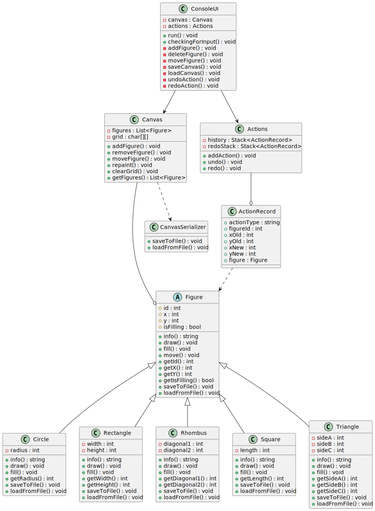

# Console paint (Антонова Лидия Сергеевна [353504])

**Описание проекта:**  Консольное приложение для рисования базовых фигур: треугольников, кругов, прямоугольников, квадратов и ромбов, с возможностью удаления, заполнения и перемещения фигур, отмены действий, а также сохранения и загрузки холста в файл и из файла.

## **Функциональные требования:** 
* **Рисование**  
Возможность создания фигур трёх типов: базовых фигур: треугольников, кругов, прямоугольников, квадратов и ромбов. Длина радиуса и сторон > 0. До создания фигуры проверяется её корректность. Фигуры рисуются с помощью символа *.  
**Треугольник** 
Рисуется с использованием координат одной из вершин и длин трех сторон.  
**Круг** 
Рисуется с использованием координат центра и радиуса.  
**Прямоугольник** 
Рисуется с использованием координат левой верхней вершины и длин двух сторон.  
**Квадрат** 
Рисуется с использованием координат левой верхней вершины и длины стороны.  
**Ромб** 
Рисуется с использованием координат центра и длин двух диагоналей.  
**Обработка ошибок** 
Если попытка создать фигуру не увенчалась успехом, пользователю отображается соответствующее сообщение об ошибке.

* **Удаление** 
Можно выбрать любую из нарисованных фигур, чтобы удалить ее. Перед применением удаления проверяется его корректность.  
**Обработка ошибок** 
Если действие удаления некорректно, пользователю отображается соответствующее сообщение об ошибке.

* **Заливка** 
Фигуры заливаются символом заливки. Вы можете выбрать, какую из нарисованных фигур закрасить.  
**Обработка ошибок** 
Если действие заливки выполнено неправильно, пользователю отображается соответствующее сообщение об ошибке.

* **Перемещение** 
Можно выбрать любую из нарисованных фигур, чтобы переместить ее. Перед применением перемещения проверяется его корректность.  
**Обработка ошибок** 
Если действие перемещения некорректно, пользователю отображается соответствующее сообщение об ошибке.

* **Сохранение и загрузка** 
Возможность сохранить текущий рисунок в файл и загрузить его позже. Проверка правильности пути к файлу и его содержимого.  
**Обработка ошибок** 
Если действие сохранения/загрузки выполнено неправильно, пользователю отображается соответствующее сообщение об ошибке.

* **Действия отмены и повтора** 
Возможность отменить последнее успешное действие и повторить отмененное действие.

* **Команды** 
При запуске программы автоматически выполняется команда help. При входе пользователя в режим ему отображается справка и список нарисованных фигур для выполнения этих команд.  

## **Class diagram** 
