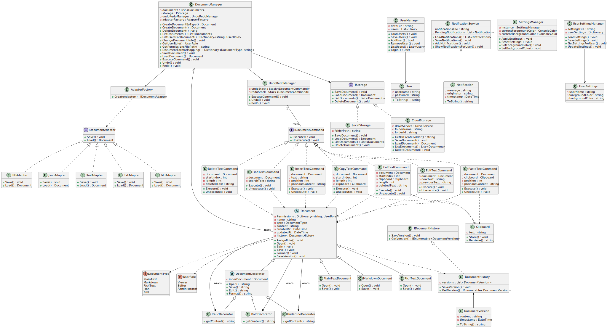

# Консольный редактор документов (Антонова Лидия Сергеевна [353504])

**Описание проекта:**  
Консольный редактор документов на языке C++ предоставляет пользователям возможность создавать, редактировать, форматировать и сохранять документы, используя принципы объектно-ориентированного программирования и проверенные шаблоны проектирования. 

## **Функциональные требования**

### **Управление документами**
- Пользователь может создавать, загружать, редактировать и удалять документы.
- Поддерживаются различные типы документов: обычный текст, Markdown и форматированный текст.
- Возможность сохранения и загрузки документов в различных форматах (TXT, MD, RTF) – реализация через шаблон *Адаптер*.

---

### **Редактирование и форматирование текста**
- Ввод и редактирование текста с функциями вставки, удаления и изменения содержимого.
- Применение форматирования (полужирный, курсив, заголовки трех уровней) посредством оборачивающих объектов – использование шаблона *Декоратор*.
- Поддержка операций копирования, вырезания и вставки текста.

---

### **Система отмены/повтора**
- Реализация возможности отмены последнего действия.
- Поддержка повторного выполнения отменённых действий.

---

### **Параметры хранения**
- Сохранение документов в локальных файлах.
- Поддержка облачного хранилища для гибкого доступа с разных устройств.

---

### **Роли и разрешения пользователей**
- Определение и поддержка разных ролей:
  - **Просмотрщик:** доступ только для чтения.
  - **Редактор:** возможность вносить изменения в документ.
  - **Администратор:** управление пользователями и их правами.
- Управление правами доступа.
- Автоматическое уведомление пользователей об изменениях в документе.

---

### **Настройки и персонализация**
- Глобальные настройки редактора (цвет фона и цвет текста).
- Персонализация интерфейса в зависимости установленных ранее пользователем параметров.
- Ведение истории изменений для анализа эволюции документа.

---

## **Class diagram**

