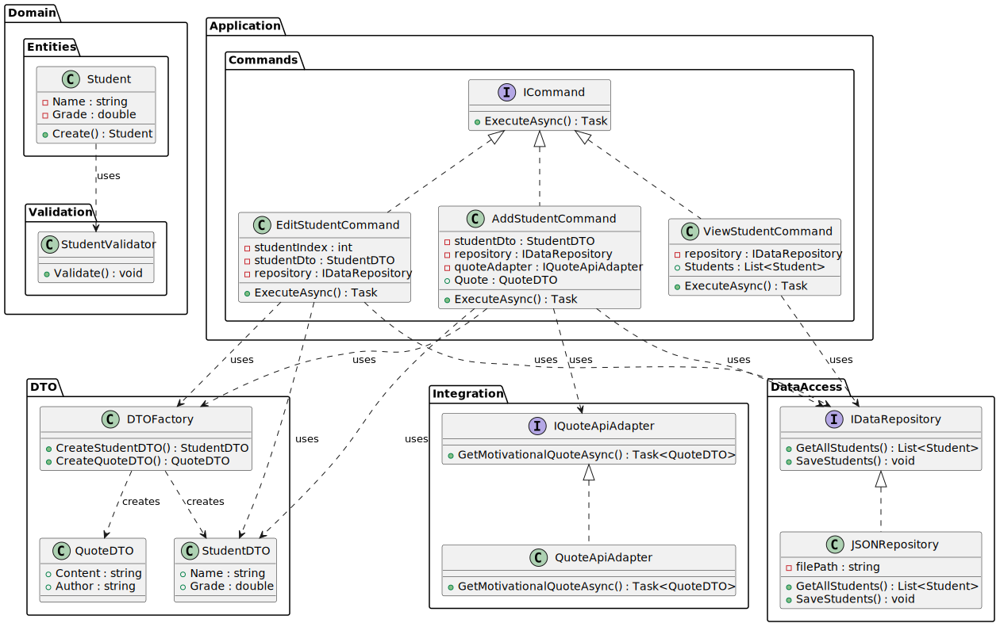

# Консольная система управления данными учащихся  (Антонова Лидия Сергеевна [353504])

## Описание проекта
Консольное приложение на языке C# построено по принципам многоуровневой архитектуры. Приложение позволяет управлять данными учащихся (добавление, редактирование, просмотр) и сохранять информацию в JSON-файле без использования СУБД. После успешного добавления нового учащегося система обращается к внешнему API (например, quotable.io) для получения мотивирующей цитаты, которая выводится в консоль. Для передачи данных между слоями используются объекты DTO, а также задействованы проверенные шаблоны проектирования для повышения масштабируемости и поддержки проекта.

## Функциональные требования

### 1. Управление данными учащихся
- **Добавление учащегося:**  
  - Пользователь может добавить нового ученика, введя его имя и оценку.
  - Ввод данных проходит проверку: имя не должно быть пустым, а оценка должна соответствовать заданным ограничениям (например, не может быть меньше 0).

- **Редактирование данных:**  
  - Обеспечивается возможность изменения информации уже добавленных учащихся.
  - При редактировании данные повторно проходят валидацию.

- **Просмотр данных:**  
  - Пользователь может просматривать список всех учащихся с их данными.

- **Хранение данных:**  
  - Все записи сохраняются в JSON-файле, что позволяет работать без использования базы данных.

---

### 2. Интеграция API для получения мотивирующих цитат
- **Вызов внешнего API:**  
  - После успешного добавления нового учащегося приложение отправляет запрос к API (например, [quotable.io](https://quotable.io)) для получения мотивирующей цитаты.
  - Для абстрагирования от конкретных деталей API используется шаблон *Адаптер*, что упрощает замену источника цитат в будущем.

- **Обработка данных цитаты:**  
  - Ответ API преобразуется в объект `QuoteDTO`, содержащий текст цитаты (и при необходимости имя автора).
  - Полученная цитата выводится в консоль сразу после добавления ученика.

---

### 3. Многоуровневая архитектура
- **Уровень представления (UI):**  
  - Обрабатывает ввод команд и вывод информации через консоль.
  - Отвечает за отображение результатов работы (например, список учащихся и мотивирующая цитата).

- **Уровень приложения (бизнес-логика):**  
  - Управляет взаимодействием между слоями, реализует сценарии использования (добавление, редактирование, просмотр).
  - Применяет поведенческий шаблон (*Command Pattern*) для реализации операций с учащимися.

- **Уровень домена:**  
  - Содержит основные бизнес-объекты и правила.  
    - **Сущность «Студент»:** включает данные (имя, оценка) и проводит проверку корректности входных данных.
    - Использует фабричный метод для создания экземпляров объектов `Student` и `QuoteDTO`.

- **Уровень доступа к данным:**  
  - Отвечает за сохранение и загрузку данных учащихся в/из JSON-файла.
  - Инкапсулирует всю логику работы с хранилищем данных.

---

### 4. DTO (Объекты передачи данных)
- **StudentDTO:**  
  - Используется для передачи проверенных данных о студенте из консольного интерфейса в сервисный слой.
  - Обеспечивает защиту данных от некорректных изменений.

- **QuoteDTO:**  
  - Представляет данные мотивирующей цитаты, полученные из внешнего API.
  - Структурирует информацию для последующего отображения в консоли.

---

### 5. Шаблоны проектирования
- **Поведенческий шаблон (Command Pattern):**  
  - Служит для организации операций с учащимися (добавление, редактирование, просмотр), что позволяет масштабировать функциональность проекта.

- **Структурный шаблон (Adapter Pattern):**  
  - Инкапсулирует вызов внешнего API для получения цитат, скрывая детали реализации и облегчая поддержку.

- **Шаблон создания (Фабричный метод):**  
  - Централизует процесс создания объектов `Student` и `QuoteDTO`, повышая гибкость и управляемость инициализации объектов.

---

### 6. Тестовые сценарии
- **Тест добавления студента:**  
  - Проверить корректное добавление нового учащегося.
  - Убедиться, что после добавления вызывается API и выводится мотивирующая цитата.

- **Тест API цитат:**  
  - Проверить корректность вызова API.
  - Убедиться, что полученный ответ правильно преобразуется в объект `QuoteDTO` и цитата отображается в консоли.

- **Тест валидации данных ученика:**  
  - Убедиться, что некорректный ввод (например, оценка меньше 0) приводит к отклонению операции и выводу соответствующего уведомления.

---

## **Class diagram**
